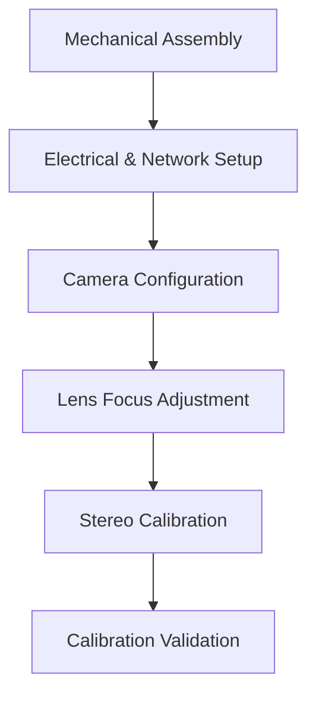
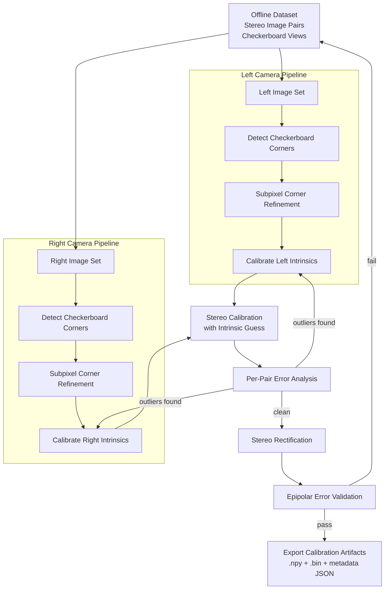

# Agrippa Stereo Camera Bring-Up Guide

<!-- DOCUMENT: Agrippa Stereo Camera Bring-Up Guide -->
<!-- PURPOSE: High-level and detailed workflow for building and calibrating an Agrippa stereo camera system -->
<!-- AUDIENCE: Engineers performing mechanical, electrical, and calibration bring-up -->
<!-- STATUS: Living engineering document -->

---

## Overview

<!-- SECTION: Overview -->
<!-- DESCRIPTION: High-level workflow for building and commissioning an Agrippa stereo camera -->
<!-- DIAGRAM: Bring-Up Workflow -->

This document defines the ordered workflow required to bring an Agrippa stereo camera system into operational state.

---

## 1. Mechanical Assembly

<!-- SECTION: Mechanical Assembly -->
<!-- OBJECTIVE: Build rigid stereo baseline with correct alignment -->

### Goals
- Rigidly mount both cameras
- Fix stereo baseline distance
- Ensure no mechanical flex between cameras
- Lock M12 lenses with thread locker (after focus)

### Best Practices
- Use a machined or single-piece mount
- Avoid adjustable mechanisms after calibration
- Ensure no cable strain induces torque

---

## 2. Electrical & Network Setup

<!-- SECTION: Electrical & Network Setup -->
<!-- OBJECTIVE: Ensure deterministic connectivity and power stability -->

### Goals
- Provide stable regulated power
- Configure static IPs (if required)
- Verify GigE throughput
- Confirm hardware trigger wiring

### Validation Checklist
- Cameras visible in Lucid Arena
- No packet loss
- Hardware trigger verified on scope

---

## 3. Camera Configuration

<!-- SECTION: Camera Configuration -->
<!-- OBJECTIVE: Lock imaging parameters before calibration -->

### Lock These Parameters Before Calibration
- Exposure time
- Gain
- Gamma (disable if possible)
- Resolution
- Pixel format
- Frame rate

Calibration is only valid for fixed intrinsics.

---

## 4. Lens Focus Adjustment

<!-- SECTION: Lens Focus Adjustment -->
<!-- OBJECTIVE: Achieve consistent and matched focus between stereo pair -->

### Recommended Method
- Use Laplacian variance metric
- Focus at intended working distance
- Focus both cameras at same distance
- Lock lens mechanically after adjustment

Focus should be finalized **before calibration image capture**.

---

## 5. Stereo Calibration

<!-- SECTION: Stereo Calibration -->
<!-- OBJECTIVE: Estimate intrinsic and extrinsic parameters for stereo reconstruction -->
<!-- TOOLING: OpenCV (offline calibration phase only) -->
<!-- OUTPUT: Calibration artifacts used by runtime pipeline -->

Stereo calibration is performed **offline** using pre-captured checkerboard images.

---

### 5.1 Calibration Image Capture Requirements

<!-- SUBSECTION: Image Capture Best Practices -->
<!-- SOURCE: Calib.io Knowledge Base (industry best practices) -->

The quality of calibration depends far more on image capture than solver choice.

#### Pattern Requirements

- High-quality printed checkerboard
- Flat and rigid mounting
- Known square size (e.g., 7.5 mm)
- Matte surface to avoid reflections

According to Calib.io, pattern flatness and accurate square size are critical to avoiding systematic calibration bias.[^1]

---

#### Number of Images

- Minimum: 15–20 usable stereo pairs
- Recommended: 25–40 diverse views

More views improve robustness and reduce overfitting.[^2]

---

#### Viewpoint Diversity (Critical)

Each stereo pair should vary in:

- Position (move across entire FOV)
- Orientation (tilt around all axes)
- Distance (near, mid, far range)
- Corner coverage (especially near image edges)

Calib.io emphasizes that calibration images must span the **entire sensor area**, especially corners, to properly constrain distortion parameters.[^3]

Avoid:
- All images centered
- All images parallel to camera
- All images at same distance

---

#### Lighting Conditions

- Even, diffuse lighting
- No motion blur
- No saturated pixels
- High contrast between black/white squares

Reflections and blur degrade subpixel corner accuracy.[^4]

---

#### Focus & Exposure Stability

- Lock exposure before capture
- Lock gain before capture
- Disable auto-exposure
- Do not refocus mid-sequence

Intrinsics are only valid for fixed focus and focal length.[^5]

---

### 5.2 OpenCV Calibration Workflow

<!-- SUBSECTION: OpenCV Solver Workflow -->

The OpenCV stereo calibration workflow proceeds as follows:

---

#### Step 1 — Detect Corners (Left & Right Independently)

- `cv::findChessboardCorners`
- `cv::cornerSubPix` refinement
- Pairs where the board is not fully visible in both frames are discarded

Corner detection happens independently per camera.

---

#### Step 2 — Calibrate Each Camera Intrinsics

- `cv::calibrateCamera` run independently on left and right
- Estimate per-camera: fx, fy, cx, cy, distortion coefficients
- Report per-camera RMS reprojection error
- Flag large RMS divergence between cameras (focus mismatch, bad lens)

This produces per-camera intrinsic models used as the initial guess for
Step 3.

---

#### Step 3 — Stereo Calibration

- `cv::stereoCalibrate` with `CALIB_USE_INTRINSIC_GUESS`
- Per-camera intrinsics from Step 2 seed the joint solver
- Solve for: Rotation (R), Translation (T), Essential and Fundamental matrices

---

#### Step 4 — Per-Pair Error Analysis & Outlier Rejection

- Re-derive per-image poses via `cv::solvePnP` + `cv::projectPoints`
- Compute per-pair RMS for both cameras
- Flag outlier pairs (> 2× median RMS)
- Remove outliers and re-run Steps 2–3 if needed

---

#### Step 5 — Stereo Rectification

- `cv::stereoRectify`
- Compute rectification transforms (R1, R2, P1, P2, Q)
- `cv::initUndistortRectifyMap` for both cameras
- Determine valid stereo ROI

---

#### Step 6 — Epipolar Error Validation

- Undistort and rectify all detected corner pairs
- Measure absolute y-difference between corresponding left/right points
- Mean epipolar error must be < 0.5 px for reliable disparity
- If > 1.0 px, re-capture calibration images

---

#### Step 7 — Export Artifacts

Export to `calib_result/`:
- Intrinsic matrices and distortion coefficients
- R, T, E, F
- Rectification maps (`.npy` for Python, `.bin` for C runtime)
- Valid ROI bounds
- Q matrix (disparity-to-depth)
- `calibration_meta.json` with all key parameters and quality metrics

Runtime system does not depend on OpenCV.

---

### 5.3 Stereo Calibration Workflow Diagram (Offline)

<!-- DIAGRAM: Stereo Calibration Workflow (Parallelized – Offline) -->

---

## 6. Calibration Validation

<!-- SECTION: Calibration Validation -->
<!-- OBJECTIVE: Confirm calibration accuracy before deployment -->

`2.Calibration.ipynb` provides quantitative validation at three levels:

### Automated Checks (in notebook)

| Metric | Target | Notebook cell |
|--------|--------|---------------|
| Per-camera RMS reprojection error | < 0.5 px | Per-camera intrinsic calibration |
| Stereo RMS reprojection error | < 0.5 px | Stereo calibration |
| Per-pair RMS (outlier detection) | < 2× median | Per-pair reprojection error analysis |
| Mean epipolar error (y-difference) | < 0.5 px | Rectification quality |

### Visual Checks (in notebook)

- Rectified stereo pair with horizontal scanlines overlay
- Per-pair reprojection error bar chart

### Post-Calibration Checks (manual)

- Depth sanity check on known geometry (use `3.Depthmap_with_Tuning_Bar.ipynb`)
- Disparity range estimation provides expected `numDisparities`/`minDisparity` for your working distance

### Red Flags

- High distortion at image corners
- Depth skew across image
- Systematic reprojection bias (one camera consistently worse)
- Mean epipolar error > 1.0 px

If calibration quality is poor:
- Re-evaluate image diversity (see Section 5.1)
- Re-check pattern flatness
- Confirm focus stability
- Use per-pair error analysis to remove outlier captures

---

# References

[^1]: Calib.io Knowledge Base – Importance of calibration target flatness and manufacturing precision.
[^2]: Calib.io – Recommended number of calibration images for stable parameter estimation.
[^3]: Calib.io – Full image coverage required for accurate distortion modeling.
[^4]: Calib.io – Impact of blur and lighting on corner detection accuracy.
[^5]: Calib.io – Intrinsics depend on fixed focus and focal settings.
