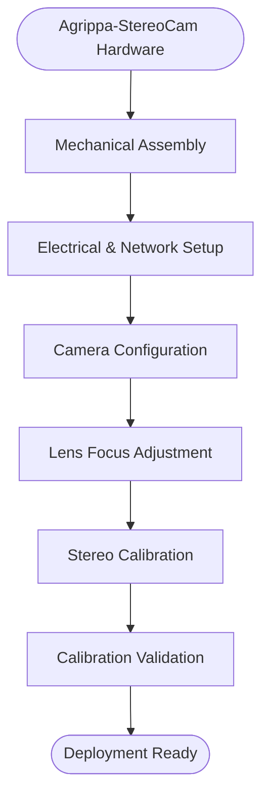
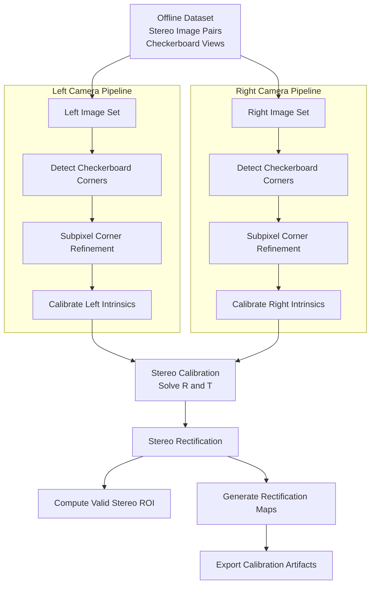

<!-- DOCUMENT: AGRIPPA_STEREO_CAMERA_BRINGUP_GUIDE -->
<!-- PURPOSE: SYSTEM_LEVEL_BRINGUP_AND_CALIBRATION_WORKFLOW -->
<!-- AUDIENCE: ENGINEERING / ROBOTICS / VISION_SYSTEMS -->
<!-- PARSING_HINT: EACH MAJOR SECTION IS EXPLICITLY DELIMITED WITH SECTION TAGS -->

# Agrippa Stereo Camera Bring-Up Guide

<!-- INTRODUCTION -->
<!-- SUMMARY: END_TO_END_WORKFLOW_FROM_ASSEMBLY_TO_DEPLOYMENT -->

This document defines the end-to-end workflow for assembling, configuring, calibrating, and validating an **Agrippa StereoCam** system.

The guide is organized in progressive phases from hardware assembly through geometric calibration and deployment readiness.

---

<!-- SECTION: OVERVIEW -->
# 1. Overview

<!-- DIAGRAM: HIGH_LEVEL_BRINGUP_WORKFLOW -->
<!-- DIAGRAM_SCOPE: SYSTEM_LEVEL_PHASES -->

The following diagram summarizes the full bring-up workflow at a system level.

Each block in this diagram corresponds to a section below.

---

<!-- SECTION: MECHANICAL_ASSEMBLY -->
<!-- PHASE_TYPE: HARDWARE -->
# 2. Mechanical Assembly

<!-- OBJECTIVE: ESTABLISH_RIGID_GEOMETRY -->
## Objective

Establish a mechanically rigid and geometrically stable stereo camera platform.

<!-- SCOPE: MECHANICAL_TASKS -->
## Scope

- Mount image sensors  
- Install and secure M12 lenses  
- Set and measure stereo baseline  
- Ensure structural rigidity  
- Lock all adjustable mechanical components  

<!-- REQUIREMENTS: MECHANICAL_CONSTRAINTS -->
## Requirements

- Baseline must not shift after calibration  
- Optical axes should be approximately parallel  
- No lens rotation after focus lock  
- Thermal expansion considerations if applicable  

Mechanical stability directly affects stereo extrinsics and long-term calibration validity.

---

<!-- SECTION: ELECTRICAL_NETWORK_SETUP -->
<!-- PHASE_TYPE: SYSTEM_CONFIGURATION -->
# 3. Electrical & Network Setup

<!-- OBJECTIVE: ESTABLISH_STABLE_GIGE_COMMUNICATION -->
## Objective

Establish deterministic and stable camera communication over GigE.

<!-- SCOPE: NETWORK_TASKS -->
## Scope

- Power delivery validation  
- Ethernet link verification  
- Static IP assignment  
- GigE Vision device discovery  
- Confirm synchronized acquisition capability  

<!-- REQUIREMENTS: NETWORK_CONSTRAINTS -->
## Requirements

- Deterministic frame capture  
- Stable link speed (1GbE or higher)  
- No packet loss under load  
- Confirm hardware trigger (if used)  

Network reliability must be verified before any calibration image capture.

---

<!-- SECTION: CAMERA_CONFIGURATION -->
<!-- PHASE_TYPE: SENSOR_CONFIGURATION -->
# 4. Camera Configuration

<!-- OBJECTIVE: LOCK_SENSOR_PARAMETERS -->
## Objective

Lock all sensor parameters prior to optical adjustment and calibration.

<!-- SCOPE: SENSOR_SETTINGS -->
## Scope

- Set resolution  
- Lock frame rate  
- Disable auto exposure  
- Disable auto gain  
- Disable auto white balance  
- Fix pixel format  

<!-- CRITICAL_RULE: NO_PARAMETER_CHANGES_AFTER_CALIBRATION -->
## Critical Rule

**No imaging parameters may change after calibration.**

Calibration is resolution- and mode-specific.

---

<!-- SECTION: LENS_FOCUS_ADJUSTMENT -->
<!-- PHASE_TYPE: OPTICAL_CONFIGURATION -->
# 5. Lens Focus Adjustment

<!-- OBJECTIVE: SET_OPTIMAL_WORKING_DISTANCE_FOCUS -->
## Objective

Set optical focus at the intended working distance.

<!-- PROCEDURE: HIGH_LEVEL -->
## Procedure Overview

- Stream live images  
- Focus at nominal operating distance  
- Maximize sharpness across field  
- Verify edge clarity  
- Lock lens mechanically  

<!-- CRITICAL_RULE: FOCUS_LOCK_REQUIRED -->
## Critical Rule

Focus must not change after stereo calibration.

Even small focus shifts alter intrinsics.

---

<!-- SECTION: STEREO_CALIBRATION -->
<!-- PHASE_TYPE: GEOMETRIC_CALIBRATION -->
# 6. Stereo Calibration

<!-- OBJECTIVE: COMPUTE_INTRINSICS_AND_EXTRINSICS -->
## Objective

Compute:

- Intrinsic parameters (Left & Right)  
- Stereo extrinsics (R, T)  
- Rectification transforms  
- Disparity-to-depth mapping (Q matrix)  
- Rectification maps for runtime  

Calibration is performed offline using a pre-captured dataset.

---

<!-- SUBSECTION: CALIBRATION_WORKFLOW -->
<!-- DIAGRAM: DETAILED_PARALLEL_OFFLINE_CALIBRATION -->
## 6.1 Stereo Calibration Workflow (Parallelized – Offline)

---

<!-- SUBSECTION: CALIBRATION_OUTPUTS -->
<!-- ARTIFACTS: RUNTIME_REQUIRED_FILES -->
## 6.2 Calibration Outputs

The following artifacts must be exported:

- Left intrinsic matrix (K₁)  
- Right intrinsic matrix (K₂)  
- Distortion coefficients (D₁, D₂)  
- Rotation matrix (R)  
- Translation vector (T)  
- Rectification transforms (R₁, R₂)  
- Projection matrices (P₁, P₂)  
- Q matrix  
- Rectification maps (left & right)  

These are consumed by the runtime pipeline.

---

<!-- SECTION: CALIBRATION_VALIDATION -->
<!-- PHASE_TYPE: QUALITY_ASSURANCE -->
# 7. Calibration Validation

<!-- OBJECTIVE: VERIFY_GEOMETRIC_ACCURACY -->
## Objective

Verify that calibration quality meets system requirements.

<!-- VALIDATION_CHECKS -->
## Validation Checks

### 1. Reprojection Error
- Target < 0.5 px (typical)  
- Investigate if > 1.0 px  

### 2. Rectified Alignment
- Horizontal epipolar lines  
- No vertical disparity  

### 3. Depth Sanity Test
- Measure known baseline object  
- Confirm correct scale  
- Validate near and far range behavior  

<!-- FAILURE_HANDLING -->
If validation fails:

- Re-check focus  
- Re-check mechanical stability  
- Re-capture dataset  

---

<!-- SECTION: DEPLOYMENT -->
<!-- PHASE_TYPE: SYSTEM_INTEGRATION -->
# 8. Deployment Ready

Once validated:

- Freeze mechanical configuration  
- Archive calibration artifacts  
- Version-control calibration files  
- Deploy to runtime system  

<!-- RUNTIME_REQUIREMENTS -->
Runtime must:

- Load rectification maps  
- Perform undistort + rectify  
- Compute disparity  
- Compute depth using Q matrix  

No calibration logic runs in production runtime.

---

<!-- SECTION: APPENDIX_RUNTIME_SEPARATION -->
<!-- DESIGN_PRINCIPLE: OFFLINE_CALIBRATION_RUNTIME_MINIMALISM -->
# Appendix: Runtime Separation Philosophy

Calibration phase:
- Heavy math  
- OpenCV allowed  
- Offline dataset processing  

Runtime phase:
- Lightweight  
- Dependency-minimized  
- Deterministic performance  
- Uses exported artifacts only  
